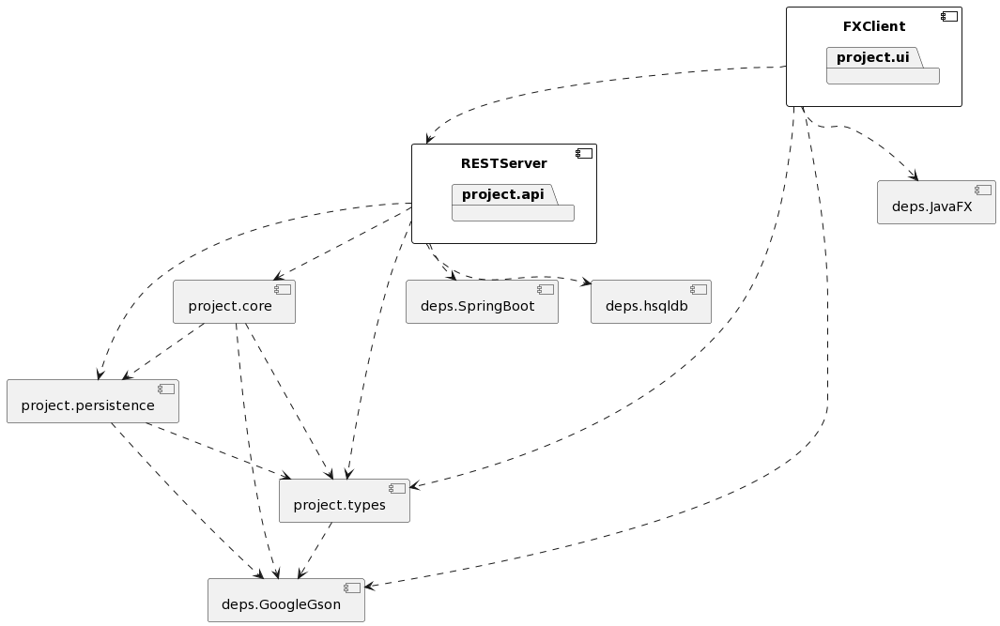

# WordDetective: Substring Edition - release 3

This is the third and final release of "WordDetective: Substring Edition".
In this release, we have focused on building a REST API for the core logic, as well as further developing our JavaFX application. The JavaFX application has been supplemented with more functionality (which will be explained in detailed later in this document), and the quality of the code has been improved by thorough code reviews and improved test coverage. It's also worth mentioning that we have created a few new modules (for example the api module), to separate the functionality of the program.
Furthermore, we have continued with the work routines from the previous releases. This includes the use of a milestone, issueboard with issues, separate brances for various imlpementations, pair-coding, and code reviews in the merge requests.

The requirements for the third release have been fulfilled in the following manner:

## Architecture

### JavaFX Client
The application still uses the JavaFX Client that was built in Release 2 during the second sprint. Through this third sprint we have added additional features which is listed under _Functionality_.

The UI does no longer uses <code>core</code> directly, but is changed to communicate the newly built use-case layer REST server that talks to <code>core</code>.

As functionality has expanded in the third sprint. We have enden up making new TestFX integration tests to further test our code

**Built with:**
- [Java](https://www.java.com/en/)
  - Uses Java 17.0.8
- [JavaFX](https://openjfx.io/)
  - client/ui application library for java

**Dependencies:**
- [JavaFX](https://openjfx.io/)
- [Google Gson](https://github.com/google/gson)

### Backend
The backend application is now a refactor of the <code>core</code> layer used in release 2.
We have created a REST API over HTTP that uses a Spring Boot server.

The redefined backend follows a three-tier architecture. The distinct responsibilities are divided into the following layers:

**1. Gateway (Public) Layer:**
  This serves as the external interface accessible to clients. It is implemented through a set of Spring Boot Controllers, exposing the HTTP API.

**2. Service (Use-Case) Layer:**
  Positioned between the gateway and repository layers, this layer encapsulates the application logic, defining and enforcing the rules governing the domain. It serves as the orchestrator of business use cases.

**3. Repository (Persistence) Layer:**
Situated at the lowermost level, this layer is dedicated to the persistence and storage of domain entities. It interfaces with the underlying data storage mechanisms.

This architectural aligns closely with the principles articulated in Uncle Bob's Clean Architecture, roughly display in this diagram:

The four layers shown is represented in our application by:

**1.Entites:**
  Defined in the <code>types</code> module. This module contains only domain types used across the application

**2.Use Cases:**
  Defined in the <code>core</code> module. Contains the actions in the service layer, actions a client has at their disposal. The service layer also calls into the repsository layer which interacts with the <code>persistence</code> module.

**3.Controllers**
  the Controller layer is implemented through the Spring Controllers in the <code>api</code> module.

**4.External interfaces/Ui:** are the consumers of the Controller level, in our case, the frontend application.

By maintaining an architecture like this, the application is easier to scale and grow because you can define strict boundaries between what can depend on what.

As we built a new REST server we've also added integration tests for the controllers in the api module

**Built with:**
- [Java](https://www.java.com/en/)
  - Uses Java 19
- [Spring Boot](https://spring.io/projects/spring-boot)
  - An extensive and heavily tested server application framework for Java

**Dependencies:**
- [Spring Boot](https://spring.io/projects/spring-boot)
- [Google Gson](https://github.com/google/gson)

## Functionality

  - _New functionality from previous release_

    We have chosen to further develop our JavaFX application.
    Since the previous release, we have implemented:

    - Easy upload and deletion of custom categories (only for registered users)

      Registered users are now able to upload their own custom categories. This feature is visible in the category page, where the user is able to paste in all the words making up the wordlist, as well as give the category a name. The wordlist will then be stored persistently to the user's json file. The user also has the delete their custom categories by simply pressing the "x" button next to the category in the categoy selector.

    - Navigation features

      We received feedback that the program lacked a way to navigate to previous scenes.
      For example, once the user had chosen a category and was sent into a game, there was no possibility to go back to the category page to select a different category. We have now implemented this feature, in the form of a "go-back-button" in the top left corner of all scenes.

    - In-game "game-over-timer-indicator"

      From the start, we planned to give the user a certain amount of time to guess the correct word, or else the game would end. Initially, we thought of having a simple timer displaying this remaining time. However, for a more entertaining user experience, we implemented this "game-over-timer-indicator" as the substring falling down towards the user, and if the substring reaches the user, the game is over.

    - Updated user interface

      The user interface now displays an intriguing background video, as well as a catchy tune.

    - Information pane in category page

      For first time user's the purpose of choosing categories may not be clear. Thus, we have implemented a pane in the category page which gives information regarding what the purpose of choosing a category is.

    - Hidden word showcased on gameover

      If you were not able to find out what word the substring was apart of you can now see what the hidden word was.

  - _Use of the API_

    As mentioned in the "Architecture" section, we have created an API which encapsulates the core functionaliy. Thus, when the user interacts with the UI, and there is a demand for information from the core functionality, the UI module sends a HTTP request to the API, which in turn delegates the task to the core module.

  - _Maven commands_

    We have continued with maven commands for this program.
    In addition to the previously used maven commands, we have also introduced a command to spin up the web server: `mvn -f pom.xml spring-boot:run`

  - _Tests and code quality_

    For code quality, we have continued using checkstyle and spotbugs. In addition to these tools, we have conducted thorough code reviews on each and every merge request. The merge requests which did not satisfy the code review received threads, which had to be resolved before the merge request was approved.
     
    For testing, we have made sure to write tests for all modules. The tests are set up to run with maven with "mvn test", and jacoco reports can be created separately for each module by entering the module, and then use "mvn jacoco: report".

## Work routines
  Our rutine has consisted of sprints where each sprint were dedicated to each milestone. This is the rutines we used to obtain a good work flow:
  - <code>Milestones</code> As with the previous releases, we started this release with a milestone. The milestone would contain checkboxes of all the requirments and all issues needed to be done before the deadline.

  - <code>Sprints</code> Throughout the semester we've worked in sprints. Where each sprint was detecated to a milestones deadline.

  - <code>Issues</code> We've made issues for every task or change needed in the project. It would contain checkboxes explaining tasks to do in the particular issue. When felt necessary the issue would refer to a [user story](../../userstories.md).

  - <code>Branches</code> For each issue a branch would be created containg the title of the issue. This way we always knew what a branch was supposed to contain and avoided merge conflicts with each others code.
  - <code>Labels</code> Each issues would use labels to explain what kind of task it was and what importance it has. We would use labels such as **_Feature_**, **_Update_**, **_Test_**, **_Possible Implementaion_**, **_Required_**, **_Bug_** and many more.

  - <code>IssueBoard</code> To keep track of all ongoing issues we had an IssueBoard which showed all issues not started, in progress and closed. This gave us a good overview of what people where working on when we weren't with each other.

  - <code>Merge requests</code> Anytime an issue was complete the programmer had to make a merge request on Gitlab. This merge request would use a custom made template where the programmer would have to write:
    1. **Tasks**: What the issue had as tasks to do.
    2. **ChangeLog**: Bulletpoint list of everything that had been done, whether it was in the task or not.
    3. **How to Test**: A manual on how a reviewer could test what the programmer had done

    With this template, all merge request were equal, simple, clean and easy to read for a reviewer.

    The merge request would contain all labels from the issue, a link to close the issue, who the assigneed programmer was and who had co-authored on this branch aswell as a CI/CD pipeline to go through before the merge request could be merged.

  - <code>CI/CD Pipeline</code> Throughout the project each merge request had to succeed a pipeline which checked that the code could be:
    1. Built: The code could successfully build the project with Mvn clean install and mvn compile
    2. Test: The code can successfully run checkstyle, mvn test and spotbugs without error.
    3. Clean: Cleanup of installed dependencies.

    With this pipeline the project would always merge successful code and not give unpleasant errors for future branches
  - <code>Code review</code> For each merge request, a person in the group was sat as a reviewer. This person would go trough the code changes and make a review. Commenting on changes that maybe were unnecessary. At the end the reviewer would approve the merge request and comment a message on the work done. Later the programmer could merge in their own merge request
  - <code>Meetings</code> We tried following the scrum plan of having a daily meeting for 15min. These were sometimes forgotten, but catched up on during our weekly meetings we had on Tuesdays.
  - <code>Co authoring</code> Throughout the project we have co authored with each other. Sometimes this consisted of working on the same branch, but mainly it was programming together on one persons computer.

## Documentation

  - _Documentation of REST server_

    We created the API to implement the basic CRUD (create, read, update, delete) operations.
    The REST server thus supports HTTP POST, GET, PUT, and DELETE requests.
    We have used the mentioned request formats according to their intended purposes;
    POST requests to send data to the server, GET requests to read/retrieve data from the server, PUT requests to modify data on the server, and DELETE to delete data on the server.

  - _Class diagram_

    A class diagram, highlighting the most central parts of the application. These classes were chosen because they represent the core logic of what happens on the backend.
    

  - _Sequence diagram_

    Sequence diagram showcasing the logic behind the login-operation and selection of category.
    

  - _Package diagram_

    Package diagram showing the modules dependencies.
    
